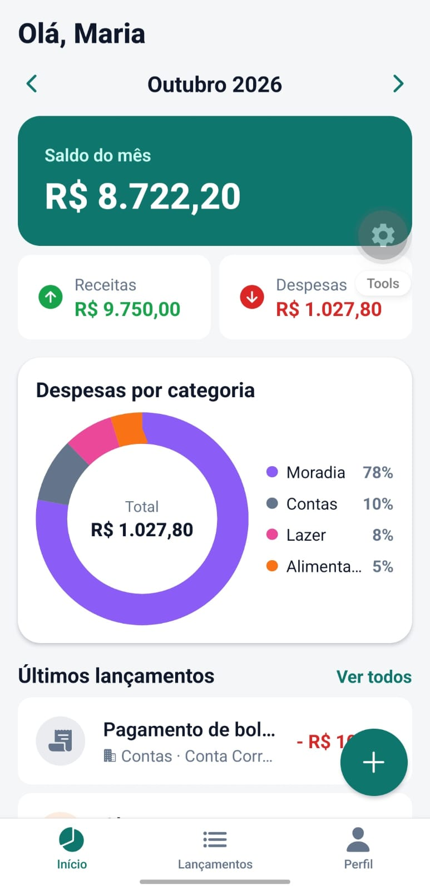
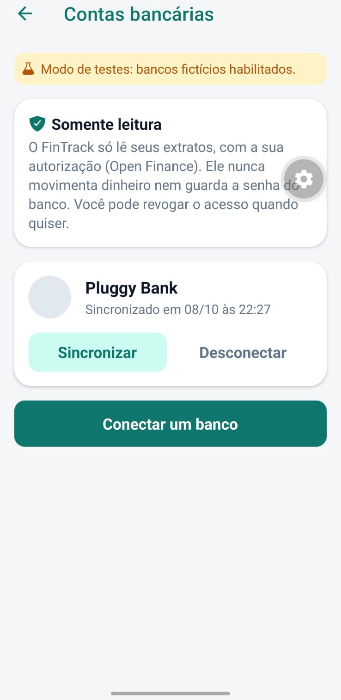

# FinTrack

Aplicativo mobile de finanças pessoais: registre receitas e despesas, **importe
lançamentos direto do seu banco via Open Finance** e acompanhe para onde o dinheiro
está indo.

Projeto da disciplina Programação para Dispositivos Móveis (IESB), construído com o guia
do Prof. Me. Bruno Assunção Dias.

## Funcionalidades

- Cadastro, login e sessão persistente (Supabase Auth)
- Lançamentos de receitas e despesas: criar, editar e excluir
- **Open Finance:** conecte seus bancos e importe extratos e faturas (somente leitura)
- Painel mensal com saldo, receitas, despesas e gráfico por categoria
- Lista agrupada por dia, com busca e filtro por tipo
- Exportação dos lançamentos em CSV
- Dados isolados por usuário com Row Level Security

## Tecnologias

React Native · Expo · Expo Router · TypeScript · Supabase (Auth, Postgres, RLS, Edge
Functions) · Pluggy (agregador Open Finance) · TanStack Query · React Hook Form · Zod ·
react-native-svg · Jest

## Capturas de tela

| Início | Lançamentos | Contas bancárias |
| ------ | ----------- | ---------------- |
|  |  |  |

As capturas usam o banco de teste do Pluggy (Pluggy Bank), nunca dados bancários reais.

## Como executar

1. Instale as dependências: `npm install`
2. Crie um projeto no [Supabase](https://supabase.com) e execute, nesta ordem,
   `supabase/schema.sql` e `supabase/open-finance.sql` no SQL Editor.
3. Copie `.env.example` para `.env` e preencha a URL e a chave pública do Supabase.
4. Open Finance (opcional): crie uma aplicação em
   [dashboard.pluggy.ai](https://dashboard.pluggy.ai) e publique as funções:
   ```
   npx supabase login
   npx supabase link --project-ref SEU-PROJECT-REF
   npx supabase secrets set PLUGGY_CLIENT_ID=... PLUGGY_CLIENT_SECRET=...
   npx supabase functions deploy bank-connect-token
   npx supabase functions deploy bank-sync
   npx supabase functions deploy bank-disconnect
   ```
5. Inicie o app: `npx expo start` e abra no Expo Go (use `--tunnel` se a rede bloquear a
   conexão entre o celular e o computador).

## Como o Open Finance funciona aqui

```
app -> bank-connect-token -> Pluggy (token de 30 min)
app -> widget do Pluggy -> consentimento no banco
app -> bank-sync -> Pluggy -> regras puras -> tabela transactions
```

As credenciais do Pluggy ficam só no servidor (segredos do Supabase). A função confere que
a conexão pertence ao usuário logado antes de importar. A sincronização é idempotente: rodar
duas vezes não duplica lançamentos, e o pagamento da fatura do cartão não é contado duas
vezes.

## Segurança

- Row Level Security em todas as tabelas: cada usuário só enxerga os próprios dados.
- Nenhuma credencial no repositório: o `.env` fica fora do Git e só a chave pública do
  Supabase vai para o app.
- Acesso somente leitura aos bancos; desconectar apaga os lançamentos importados.

## Arquitetura

Tela → hook → serviço → banco. A tela nunca fala direto com o Supabase.

| Pasta | Responsabilidade |
| ----- | ---------------- |
| `app/` | Rotas e telas (Expo Router) |
| `src/components/` | Interface reutilizável |
| `src/hooks/` | Consultas e mutações com cache (TanStack Query) |
| `src/services/` | Único lugar que conversa com o Supabase |
| `src/utils/` | Regras puras: dinheiro, datas, resumo e CSV |
| `src/schemas/` | Validação dos formulários (Zod) |
| `supabase/functions/` | Edge Functions (Deno) que guardam os segredos |

## Scripts

| Comando | O que faz |
| ------- | --------- |
| `npm start` | Inicia o servidor do Expo |
| `npm test` | Executa os testes unitários (46 testes) |
| `npm run typecheck` | Verifica os tipos com o TSC |
| `npm run format` | Formata o código (Prettier) |

## APK para Android

O APK de teste é gerado na nuvem com o EAS Build:

```
npm install -g eas-cli
eas login
eas build --platform android --profile preview
```

As variáveis `EXPO_PUBLIC_SUPABASE_URL` e `EXPO_PUBLIC_SUPABASE_KEY` são cadastradas no
painel da Expo (expo.dev), no ambiente `preview`.

## Autor

Maria Clara · [GitHub](https://github.com/mariaclarainacio)
Matheus Augusto · [GitHub](https://github.com/TheuznX)